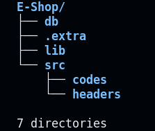

# Intro
---

- Code will follow this hierarchy (can change as per necessity)
- Header file goes in `src/headers`. Also, stick with `.hpp` extension (for CMake compatibility)
- Implementations goes in `src/codes`
- `App.cpp` -> main code entry point. We call all functions from here in final version. All other files stored in different folders as per catagory
- `CmakeLists.txt` -> append new files in `add_executables`
- `.extra` folder -> stores files which are not necesserily part of final program
